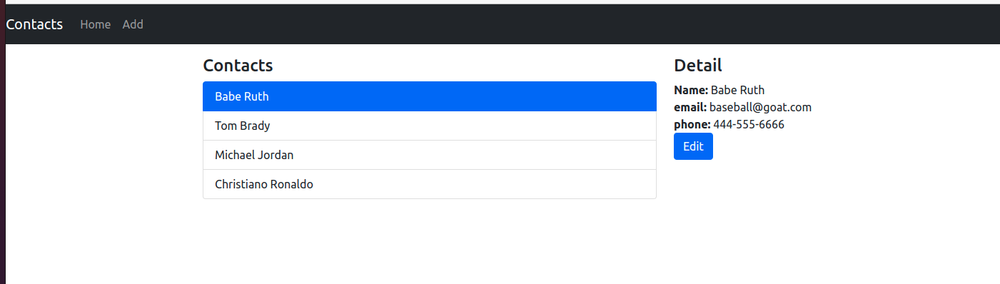
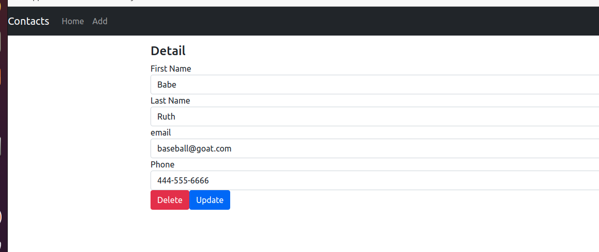

# Simple Contact Manager webapp 
## Using nodejs (express) / reactjs / posgresql (docker)

### Influenced by [bezkoder node express postgresql webapp](https://bezkoder.com/node-express-sequelize-postgresql/)


### Setup DB using docker

1. Create Postgres docker container [db setup steps here](db/README.md)


### Setup API .env

2. if you do for dev in local, rest of env info would be

   ```
   DB_HOST = localhost
   DB_PORT = 5432
   DB_NAME = postgres
   DB_USER = postgres
   DB_PASS =
   API_KEY = 
   PORT=8081
   ```

   

3. db password you created from 1, paste it in api/{.env file} -> DB_PASS

4. generate random key and put it in API_KEY

5. `$ npm install`

6. `$ node server.js`


### Setup frontend

5. create .env file in frontend/webserver dir ( copy and paste from .env.sample )

6. Enter .env info

   ```
   API_KEY={API_FOR_API}
   API_HOST=localhost
   API_PORT=8081
   PORT=8080
   ```

   replace api key with you generated in 4.

7. if you run in local, host and port would be localhost and 8080


### Run app

8. in db directory,

   ```$ docker start {container_name_from_1}
   $ docker start {container_name_from_1}
   ```

9. in api directory

   ```
   $ node server.js
   ```

10. in frontend/webserver directory

    ```
    $ node server.js
    ```


### Screenshots






